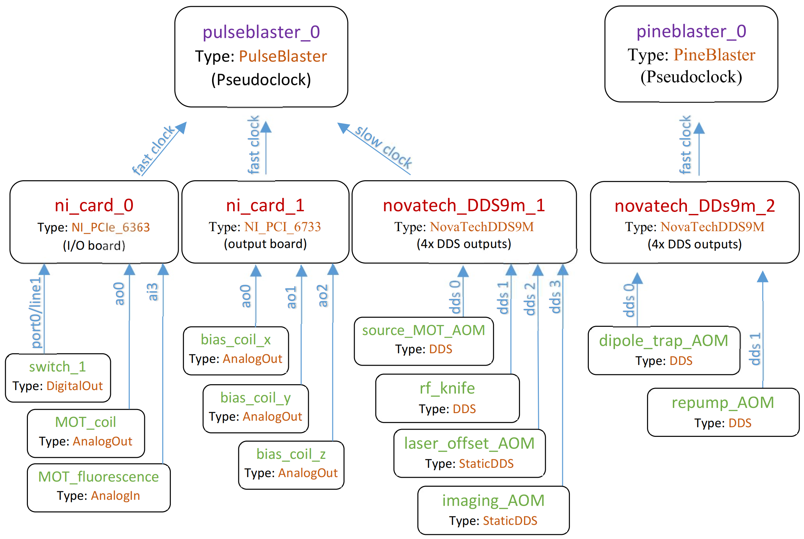

Connection Table
================
The connection table maps out the way input/output devices are connected to each other in your lab, and the channels (individual inputs/outputs) they have. The devices in your lab should be connected in a similar way to that shown in the figure below.

Here we see two :py:class:`PseudoclockDevice <labscript.core.PseudoclockDevice>` instances in the top tier of the diagram. They do not have a parent device that tells them when to update their output (this is true for all :py:class:`PseudoclockDevice <labscript.core.PseudoclockDevice>` instances). However, all but one (the master pseudoclock device) must be triggered by an output clocked by the master pseudoclock device. 

Each :py:class:`PseudoclockDevice <labscript.core.PseudoclockDevice>` instance should have one or more :py:class:`Pseudoclock <labscript.core.Pseudoclock>` children. Some :py:class:`PseudoclockDevice <labscript.core.PseudoclockDevice>` instances may automatically create these children for you (check the device specific documentation). In turn, each :py:class:`Pseudoclock <labscript.core.Pseudoclock>` will have one of more :py:class:`ClockLine <labscript.core.ClockLine>` instances connected to it. These :py:class:`ClockLine <labscript.core.ClockLine>` instances generally refer to physical outputs of a device which will be used to clock another device. However, in some cases, one or more :py:class:`ClockLine <labscript.core.ClockLine>` instances may be internally created for you (check the device specific documentation).

If a device is not a :py:class:`PseudoclockDevice <labscript.core.PseudoclockDevice>`, it must be connected to one via a clockline. such devices inherit from :py:class:`IntermediateDevice <labscript.core.IntermediateDevice>`. Inputs and outputs are then connected to these devices. For example, :py:class:`DigitalOut <labscript.outputs.DigitalOut>`, :py:class:`AnalogOut <labscript.outputs.AnalogOut>`, and :py:class:`DDS <labscript.outputs.DDS>`. See :py:module:`labscript.outputs` for a complete list. Note that devices determine what types of inputs and outputs can be connected, see :doc:`labscript-devices <labscript-devices:index>` for device information.

If a :py:class:`PseudoclockDevice <labscript.core.PseudoclockDevice>` also has outputs that are not used for a :py:class:`ClockLine <labscript.core.ClockLine>`, then an :py:class:`IntermediateDevice <labscript.core.IntermediateDevice>` is internally instantiated, and should be made available through the ``PseudoclockDevice.direct_outputs`` attribute (for example see the :py:class:`PulseBlaster <labscript_devices.PulseBlaster.PulseBlaster>` implementation).

